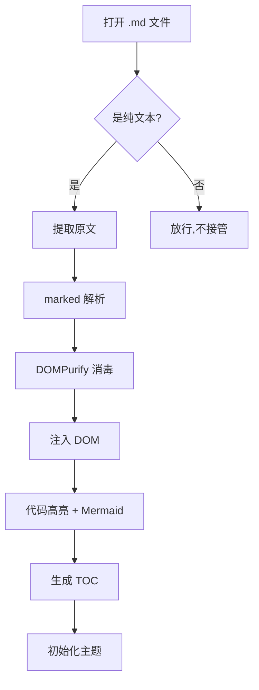
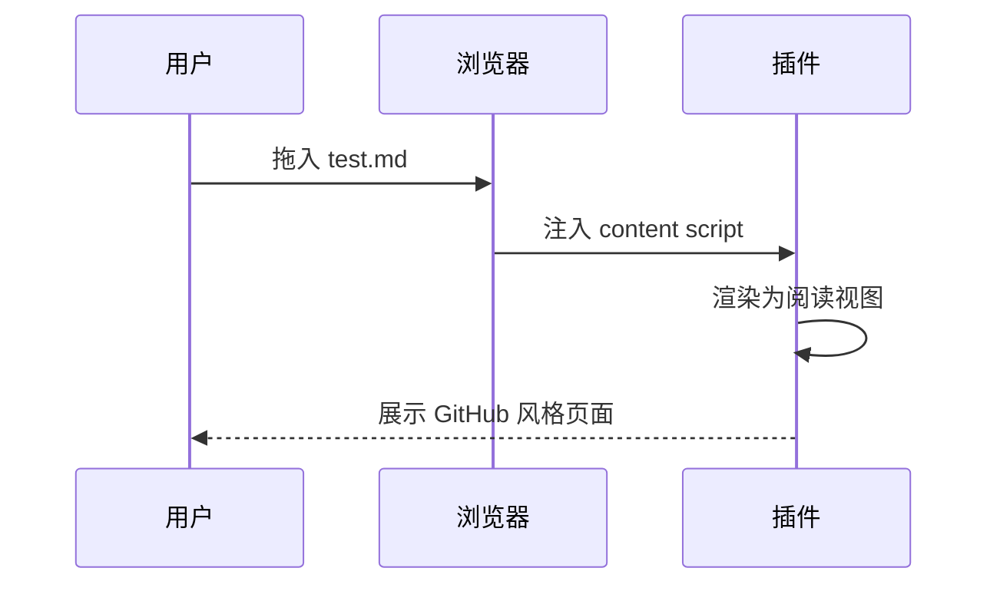

# Markdown Reader 测试文档

这是用来验证 **Markdown Reader** 插件渲染效果的样本文件。把它拖进已开启「允许访问文件网址」的 Chrome，应当看到 GitHub 风格的阅读视图。

## 1. 文本与排版

支持 **加粗**、*斜体*、~~删除线~~、`行内代码`，以及[链接](https://example.com)。

> 这是一段引用。
> 引用可以有多行。

---

## 2. 列表

无序列表：

- 第一项
- 第二项
  - 嵌套子项
  - 另一个子项
- 第三项

任务列表（GFM）：

- [x] 已完成的任务
- [ ] 未完成的任务
- [ ] 另一个待办

有序列表：

1. 步骤一
2. 步骤二
3. 步骤三

## 3. 代码高亮

JavaScript：

```javascript
function greet(name) {
  const msg = `Hello, ${name}!`;
  console.log(msg);
  return msg;
}
greet("Markdown");
```

Python：

```python
def fib(n: int) -> int:
    a, b = 0, 1
    for _ in range(n):
        a, b = b, a + b
    return a

print([fib(i) for i in range(10)])
```

## 4. 表格（GFM）

| 功能         | 状态   | 备注              |
| ------------ | :----: | ----------------- |
| 目录导航     |   ✅   | 侧边 TOC + 滚动高亮 |
| 代码高亮     |   ✅   | highlight.js      |
| 深浅色切换   |   ✅   | 记忆偏好          |
| Mermaid 流程图 | ✅   | 见下方            |

## 5. Mermaid 流程图



时序图：



## 6. 安全测试

下面这段如果 DOMPurify 工作正常，脚本不会执行，只会显示为无害文本或被移除：

<script>alert('如果你看到这个弹窗，说明 XSS 防护失效了')</script>


## 7. 长内容 / 滚动测试

### 7.1 子章节 A

用于测试 TOC 的多级缩进与滚动高亮。Lorem ipsum dolor sit amet, consectetur adipiscing elit.

### 7.2 子章节 B

继续滚动时，左侧目录应高亮当前所在章节。

#### 7.2.1 更深一级

四级标题，验证 TOC 缩进层级。

## 8. 结束

如果以上都正常显示，插件就工作正常了。🎉
